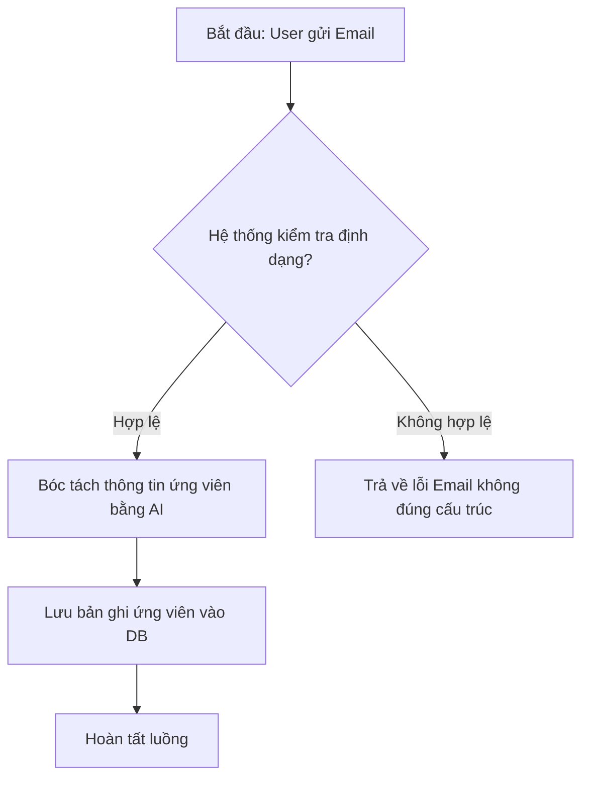

# Business Process Modeling — Team2 BA Skill

## 1. Khung Phân Tích Quy Trình (Process Analysis Framework)

Mọi luồng công việc (Workflow / Use Case) trong dự án phải được phân tích theo 9 thành phần cấu trúc:

1. **Trigger:** Tác nhân hoặc sự kiện kích hoạt luồng.
2. **Preconditions:** Điều kiện bắt buộc hệ thống/người dùng phải thỏa mãn trước khi bắt đầu.
3. **Main Flow:** Chuỗi các bước thành công chính (Happy Path).
4. **Alternate Flows:** Các luồng rẽ nhánh hợp lệ.
5. **Exception Flows:** Các luồng xử lý lỗi và ngoại lệ.
6. **Postconditions:** Trạng thái hệ thống sau khi luồng kết thúc (thành công hoặc thất bại).
7. **Data Involved:** Dữ liệu đầu vào, đầu ra và dữ liệu cần lưu trữ.
8. **Business Owner:** Đơn vị hoặc vai trò chịu trách nhiệm nghiệp vụ cho luồng.
9. **Success Outcome:** Bằng chứng hoặc giá trị thu được sau khi hoàn tất.

---

## 2. Sử Dụng Sơ Đồ Mermaid

Khuyến khích sử dụng Mermaid.js để biểu diễn quy trình khi luồng có độ phức tạp cao hoặc chứa nhiều nhánh rẽ.

