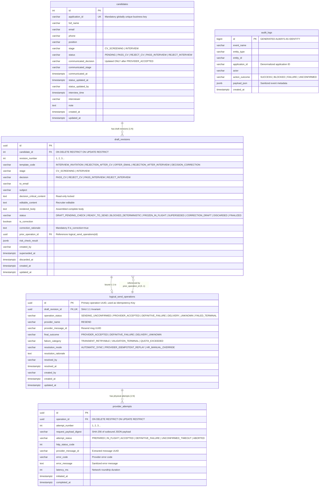

# Database Specification Document: Recruitment Mail Guard (Minimal Real-Email MVP)

## 1. Document Status
- **Status**: READY_FOR_REVIEW
- Engine: PostgreSQL 16
- **Last Updated**: 2026-08-15
- **Mode**: `existing-schema`
- **Approval State**: PENDING_USER_APPROVAL

## 2. Executive Summary
This document specifies the target 5-table relational database schema and persistence specifications for **Recruitment Mail Guard (Minimal Real-Email MVP)**. The schema enforces deterministic contradiction prevention per `Application ID + Stage`, draft revisioning with superseding and discard tracking, single-operation locking with anti-duplicate guarantees, sanitized provider attempt tracking, decoupled 3-Phase execution boundaries (Phase A DB Commit / Phase B Outbound HTTP / Phase C DB Finalize), and an append-only immutable audit trail.

## 3. Sources & Approval Evidence
- Product Spec: [`docs/product/product.md`](file:///d:/hilab/Project_W1/AI-Recruitment-Email-Assistant/docs/product/product.md) (`APPROVED_BASELINE_FOR_BA` v1.0.1, SHA-256: `316e189df41671e629c9c370a03f39b2068b422dc8d6682a5e3ae0c1707246c7`)
- Business Analysis Spec: [`docs/ba/business-analysis.md`](file:///d:/hilab/Project_W1/AI-Recruitment-Email-Assistant/docs/ba/business-analysis.md) (`READY_FOR_HANDOFF` v1.2.0-BA, SHA-256: `d425d5f0de918d0261974906122dada3834be70cf5ee14bf1041e833eeef97ab`)
- System Architecture Spec: [`docs/system-design/system-design.md`](file:///d:/hilab/Project_W1/AI-Recruitment-Email-Assistant/docs/system-design/system-design.md) (`APPROVED_FOR_HANDOFF`, SHA-256: `e684be53a735d86d7ded34368052abadea01990920b32d3331585072e3b6c1cc`)
- Approval Record: PENDING_USER_APPROVAL

## 4. Approved Engine & Ownership Boundaries
- **Engine**: PostgreSQL 16
- **Service Boundary**: FastAPI Monolith Container (`backend`)
- **Data Ownership**: Single PostgreSQL instance owns candidate application state, draft revisions, send operations, provider attempts, and the immutable audit trail (`ADR-005`).
- **Target Schema Scope**: Exactly 5 core tables (`candidates`, `draft_revisions`, `logical_send_operations`, `provider_attempts`, `audit_logs`).
- **Pre-seeded Templates**: Managed as immutable application constants/configuration in code per `DEC-005`, eliminating the `email_templates` CRUD table from the target database schema.
- **Legacy Table Disposition**: Existing legacy tables (`email_templates`, `email_queue`, `email_history`, `outbox_events`) are retired from write paths and new workflows; they are preserved in the database for reference and are not automatically dropped (`ADR-006`, `ADR-007`).

---

## 5. Conceptual Data Model

### Conceptual Entities (`ENT-###`)
- `ENT-001` **Candidate Application**: Master application record imported from Excel. Each row represents a candidate application uniquely identified by `application_id`.
- `ENT-002` **Draft Revision**: Specific rendered instance and revision of an email notification for a candidate. Incrementing revision marks older drafts `SUPERSEDED`. Supports discard tracking (`DISCARDED`) and correction drafts (`CORRECTION_DRAFT`).
- `ENT-003` **Logical Send Operation**: Single logical transmission unit bound 1:1 to a Draft Revision. Created in Phase A; frozen during flight; reused across retries without storing redundant candidate identifiers.
- `ENT-004` **Provider Attempt**: Physical outbound HTTP request attempt to Resend API. 1:N relationship with Logical Send Operation. Stores only sanitized telemetry and digests (no raw headers, no raw payloads).
- `ENT-005` **Audit Log**: Append-only immutable ledger recording lifecycle, safety checks, and transmission events.

### Value Objects (`VAL-###`)
- `VAL-001` **Application ID**: Mandatory globally unique business string (e.g. `APP-2026-001`). No synthetic/fake backfills allowed.
- `VAL-002` **Recipient Email**: Normalized, lowercase, syntax-validated recipient email address.
- `VAL-003` **Recruitment Stage**: Enum string restricted strictly to `CV_SCREENING` and `INTERVIEW`.
- `VAL-004` **Hiring Decision**: Enum string restricted strictly to `PASS_CV`, `REJECT_CV`, `PASS_INTERVIEW`, and `REJECT_INTERVIEW`.

---

## 6. Logical Model & Mermaid ERD

---

## 7. Physical Data Model (5 Target Tables)

### Table 1: `candidates`

| Column Name | Physical Data Type | Nullable | Default | Constraints | Source ID | Description & Rationale |
| :--- | :--- | :--- | :--- | :--- | :--- | :--- |
| `id` | `INTEGER GENERATED ALWAYS AS IDENTITY` | NO | Generated | `PK` | `ENT-001` | Internal surrogate primary key. |
| `application_id` | `VARCHAR(64)` | NO | None | `UQ` (`CON-001`) | `VAL-001`, `FR-012` | Mandatory globally unique candidate application identifier. Verified from source; no fake backfills. |
| `full_name` | `VARCHAR(255)` | NO | None | `CK` (`CON-002`) | `ENT-001`, `FR-001` | Candidate legal full name for template greeting. |
| `email` | `VARCHAR(255)` | NO | None | `CK` (`CON-003`) | `VAL-002`, `FR-001` | Candidate recipient email. Must match standard email regex. |
| `phone` | `VARCHAR(50)` | YES | None | None | `ENT-001` | Optional candidate phone number. |
| `position` | `VARCHAR(255)` | YES | None | None | `ENT-001`, `FR-001` | Job position applied for (descriptive attribute, not part of unique identity). |
| `stage` | `VARCHAR(80)` | NO | `'CV_SCREENING'` | `CK` (`CON-004`) | `VAL-003`, `FR-001` | Current recruitment stage (`CV_SCREENING`, `INTERVIEW`). |
| `status` | `VARCHAR(80)` | NO | `'PENDING'` | `CK` (`CON-005`) | `VAL-004`, `FR-001` | Current decision status (`PENDING`, `PASS_CV`, `REJECT_CV`, `PASS_INTERVIEW`, `REJECT_INTERVIEW`). |
| `communicated_decision` | `VARCHAR(80)` | YES | None | `CK` (`CON-005`) | `VAL-004`, `BR-002` | Outcome successfully communicated via email (Updated ONLY on `PROVIDER_ACCEPTED`). |
| `communicated_stage` | `VARCHAR(80)` | YES | None | `CK` (`CON-004`) | `VAL-003`, `BR-002` | Stage corresponding to the communicated decision. |
| `communicated_at` | `TIMESTAMPTZ` | YES | None | None | `BR-002`, `ADR-005` | Timestamp when provider confirmed acceptance of email. |
| `status_updated_at` | `TIMESTAMPTZ` | YES | None | None | `ENT-001` | Timestamp of last decision change. |
| `status_updated_by` | `VARCHAR(255)` | YES | None | None | `ENT-001` | Recruiter username who updated decision. |
| `interview_time` | `TIMESTAMPTZ` | YES | None | None | `ENT-001` | Scheduled interview timestamp. |
| `interviewer` | `VARCHAR(255)` | YES | None | None | `ENT-001` | Assigned interviewer name. |
| `note` | `TEXT` | YES | None | None | `ENT-001` | Internal recruiter notes. |
| `created_at` | `TIMESTAMPTZ` | NO | `now()` | None | `ENT-001` | Record creation timestamp in UTC. |
| `updated_at` | `TIMESTAMPTZ` | NO | `now()` | None | `ENT-001` | Record modification timestamp in UTC. |

---

### Table 2: `draft_revisions`

| Column Name | Physical Data Type | Nullable | Default | Constraints | Source ID | Description & Rationale |
| :--- | :--- | :--- | :--- | :--- | :--- | :--- |
| `id` | `UUID` | NO | `gen_random_uuid()` | `PK` | `ENT-002` | Unique draft revision identifier. |
| `candidate_id` | `INTEGER` | NO | None | `FK` (`REL-001`) | `ENT-001`, `FR-004` | References `candidates(id)` `ON DELETE RESTRICT ON UPDATE RESTRICT`. |
| `revision_number` | `INTEGER` | NO | `1` | `CK` (`CON-006`) | `FR-004`, `BR-004` | Revision sequence counter (`1`, `2`, `3`...). |
| `template_code` | `VARCHAR(80)` | NO | None | `CK` (`CON-007`) | `ENT-002`, `DEC-005` | Pre-seeded template identifier code (`INTERVIEW_INVITATION`, `REJECTION_AFTER_CV`, `OFFER_EMAIL`, `REJECTION_AFTER_INTERVIEW`, `DECISION_CORRECTION`). |
| `stage` | `VARCHAR(80)` | NO | None | `CK` (`CON-004`) | `VAL-003`, `FR-002` | Stage of candidate when draft was generated (`CV_SCREENING`, `INTERVIEW`). |
| `decision` | `VARCHAR(80)` | NO | None | `CK` (`CON-005`) | `VAL-004`, `FR-002` | Hiring decision reflected by draft (`PASS_CV`, `REJECT_CV`, `PASS_INTERVIEW`, `REJECT_INTERVIEW`). |
| `to_email` | `VARCHAR(255)` | NO | None | `CK` (`CON-003`) | `VAL-002`, `FR-001` | Recipient email address locked for this revision. |
| `subject` | `VARCHAR(500)` | NO | None | None | `FR-010` | Rendered subject line. |
| `decision_critical_content` | `TEXT` | NO | None | None | `CAP-003`, `DEC-005` | Read-only locked outcome body fragment from template config. |
| `editable_content` | `TEXT` | NO | None | None | `CAP-003`, `DEC-005` | Recruiter edited greeting, closing, and notes text. |
| `rendered_body` | `TEXT` | NO | None | None | `CAP-003`, `FR-003` | Complete assembled email body. |
| `status` | `VARCHAR(50)` | NO | `'DRAFT_PENDING_CHECK'` | `CK` (`CON-008`) | `ENT-002`, `FR-004` | Draft status lifecycle (`DRAFT_PENDING_CHECK`, `READY_TO_SEND`, `BLOCKED_DETERMINISTIC`, `FROZEN_IN_FLIGHT`, `SUPERSEDED`, `CORRECTION_DRAFT`, `DISCARDED`, `FINALIZED`). |
| `is_correction` | `BOOLEAN` | NO | `false` | None | `CAP-008`, `DEC-003` | True if generated via Decision Correction Workflow. |
| `correction_rationale` | `TEXT` | YES | None | `CK` (`CON-009`) | `CAP-008`, `BR-005` | Mandatory change rationale if `is_correction=true` (min 5 chars). |
| `prior_operation_id` | `UUID` | YES | None | `FK` (`REL-002`) | `CAP-008`, `DEC-003` | References `logical_send_operations(id)` `ON DELETE RESTRICT ON UPDATE RESTRICT` for side-by-side modal. |
| `risk_check_result` | `JSONB` | NO | `'{}'::jsonb` | None | `CAP-004`, `FR-004` | Deterministic guard evaluation results JSON. |
| `created_by` | `VARCHAR(255)` | NO | `'demo_hr'` | None | `ENT-002` | Recruiter username who generated revision. |
| `superseded_at` | `TIMESTAMPTZ` | YES | None | None | `FR-011`, `BR-007` | Timestamp when draft was superseded by newer revision. |
| `discarded_at` | `TIMESTAMPTZ` | YES | None | None | `BR-007` | Timestamp when draft was discarded by recruiter. |
| `created_at` | `TIMESTAMPTZ` | NO | `now()` | None | `ENT-002` | Revision creation timestamp in UTC. |
| `updated_at` | `TIMESTAMPTZ` | NO | `now()` | None | `ENT-002` | Revision modification timestamp in UTC. |

---

### Table 3: `logical_send_operations`

| Column Name | Physical Data Type | Nullable | Default | Constraints | Source ID | Description & Rationale |
| :--- | :--- | :--- | :--- | :--- | :--- | :--- |
| `id` | `UUID` | NO | `gen_random_uuid()` | `PK` | `ENT-003`, `DEC-004` | Primary operation UUID, used directly as `Idempotency-Key` for Resend API. |
| `draft_revision_id` | `UUID` | NO | None | `UQ, FK` (`CON-010`, `REL-003`) | `CAP-007`, `NFR-003` | References `draft_revisions(id)` `ON DELETE RESTRICT ON UPDATE RESTRICT` (Strict 1:1 Invariant). |
| `operation_status` | `VARCHAR(50)` | NO | `'SENDING_UNCONFIRMED'` | `CK` (`CON-011`) | `ENT-003`, `DEC-004` | Current status of send operation (`SENDING_UNCONFIRMED`, `PROVIDER_ACCEPTED`, `DEFINITIVE_FAILURE`, `DELIVERY_UNKNOWN`, `FAILED_TERMINAL`). |
| `provider_name` | `VARCHAR(50)` | NO | `'RESEND'` | None | `CAP-006`, `ADR-002` | External provider adapter (`RESEND`). |
| `provider_message_id` | `VARCHAR(255)` | YES | None | None | `FR-006`, `SPIKE-001` | Resend email message UUID returned in 200/201 response. |
| `final_outcome` | `VARCHAR(50)` | YES | None | `CK` (`CON-011`) | `DEC-004`, `FR-006` | Normalized outcome (`PROVIDER_ACCEPTED`, `DEFINITIVE_FAILURE`, `DELIVERY_UNKNOWN`, `FAILED_TERMINAL`). |
| `failure_category` | `VARCHAR(50)` | YES | None | `CK` (`CON-012`) | `DEC-004`, `FR-007` | `TRANSIENT_RETRYABLE`, `VALIDATION_TERMINAL`, or `QUOTA_EXCEEDED`. |
| `resolution_mode` | `VARCHAR(50)` | YES | None | `CK` (`CON-013`) | `ADR-004`, `FR-007` | `AUTOMATIC_SYNC`, `PROVIDER_IDEMPOTENT_REPLAY`, or `HR_MANUAL_OVERRIDE`. |
| `resolution_rationale` | `TEXT` | YES | None | None | `ADR-004`, `AC-015` | Recorded rationale for manual recruiter resolution. |
| `resolved_by` | `VARCHAR(255)` | YES | None | None | `ADR-004` | Recruiter username who performed resolution. |
| `resolved_at` | `TIMESTAMPTZ` | YES | None | None | `ADR-004` | Timestamp of resolution. |
| `created_by` | `VARCHAR(255)` | NO | `'demo_hr'` | None | `ENT-003` | Recruiter username who initiated Send. |
| `created_at` | `TIMESTAMPTZ` | NO | `now()` | None | `ENT-003` | Phase A operation initialization timestamp in UTC. |
| `updated_at` | `TIMESTAMPTZ` | NO | `now()` | None | `ENT-003` | Phase C operation finalization timestamp in UTC. |

---

### Table 4: `provider_attempts`

| Column Name | Physical Data Type | Nullable | Default | Constraints | Source ID | Description & Rationale |
| :--- | :--- | :--- | :--- | :--- | :--- | :--- |
| `id` | `UUID` | NO | `gen_random_uuid()` | `PK` | `ENT-004` | Unique physical attempt identifier. |
| `operation_id` | `UUID` | NO | None | `FK` (`REL-004`) | `ENT-003`, `ADR-003` | References `logical_send_operations(id)` `ON DELETE RESTRICT ON UPDATE RESTRICT`. |
| `attempt_number` | `INTEGER` | NO | `1` | `CK` (`CON-006`) | `ADR-003`, `FR-007` | Physical attempt sequence counter (`1`, `2`, `3`...). |
| `request_payload_digest` | `VARCHAR(64)` | NO | None | None | `NFR-002`, `ADR-003` | SHA-256 hash digest of outbound JSON payload (Sanitized telemetry). |
| `attempt_status` | `VARCHAR(50)` | NO | `'PREPARED'` | `CK` (`CON-014`) | `ENT-004`, `ADR-005` | Attempt lifecycle (`PREPARED`, `IN_FLIGHT`, `ACCEPTED`, `DEFINITIVE_FAILURE`, `UNCONFIRMED_TIMEOUT`, `ABORTED`). |
| `http_status_code` | `INTEGER` | YES | None | None | `FR-006`, `ADR-002` | HTTP response status code (e.g. 200, 422, 503). |
| `provider_message_id` | `VARCHAR(255)` | YES | None | None | `FR-006`, `SPIKE-001` | Message UUID extracted from provider response. |
| `error_code` | `VARCHAR(100)` | YES | None | None | `NFR-004`, `FR-007` | Normalized error code (e.g. `invalid_parameter`, `rate_limit_exceeded`). |
| `error_message` | `TEXT` | YES | None | None | `NFR-004`, `FR-007` | Sanitized human-readable error description. |
| `latency_ms` | `INTEGER` | YES | None | None | `DRV-Q-004` | Outbound network duration in milliseconds. |
| `initiated_at` | `TIMESTAMPTZ` | NO | `now()` | None | `ADR-005` | Phase A attempt start timestamp in UTC. |
| `completed_at` | `TIMESTAMPTZ` | YES | None | None | `ADR-005` | Phase C attempt finish timestamp in UTC. |

---

### Table 5: `audit_logs`

| Column Name | Physical Data Type | Nullable | Default | Constraints | Source ID | Description & Rationale |
| :--- | :--- | :--- | :--- | :--- | :--- | :--- |
| `id` | `BIGINT GENERATED ALWAYS AS IDENTITY` | NO | Generated | `PK` | `ENT-005` | Monotonically increasing primary key. |
| `event_name` | `VARCHAR(100)` | NO | None | `CK` (`CON-015`) | `CAP-009`, `FR-009` | Event classification (e.g. `CANDIDATE_IMPORTED`, `DRAFT_GENERATED`, `SEND_OUTCOME_FINALIZED`). |
| `entity_type` | `VARCHAR(80)` | NO | None | None | `CAP-009`, `FR-009` | Entity name (`CANDIDATE`, `DRAFT_REVISION`, `LOGICAL_SEND_OPERATION`). |
| `entity_id` | `VARCHAR(128)` | NO | None | None | `CAP-009`, `FR-009` | String identifier of affected entity. |
| `application_id` | `VARCHAR(64)` | YES | None | None | `VAL-001`, `FR-009` | Denormalized application ID for fast recruiter timeline queries. |
| `actor` | `VARCHAR(255)` | NO | `'demo_hr'` | None | `CAP-009`, `FR-009` | Recruiter username or system actor performing action. |
| `action_outcome` | `VARCHAR(50)` | NO | None | None | `CAP-009` | Action result (`SUCCESS`, `BLOCKED`, `FAILURE`, `UNCONFIRMED`). |
| `payload_json` | `JSONB` | NO | `'{}'::jsonb` | None | `NFR-002` | Sanitized event details and change diff (PII protected). |
| `created_at` | `TIMESTAMPTZ` | NO | `now()` | None | `NFR-002`, `ADR-005` | Event timestamp in UTC. Table is immutable (`UPDATE`/`DELETE` prohibited). |

---

## 8. Keys, Constraints, and Referential Integrity

### Primary & Foreign Key Specifications (`REL-###`)
- `REL-001`: `draft_revisions.candidate_id` -> `candidates.id` (`ON DELETE RESTRICT ON UPDATE RESTRICT`)
- `REL-002`: `draft_revisions.prior_operation_id` -> `logical_send_operations.id` (`ON DELETE RESTRICT ON UPDATE RESTRICT`)
- `REL-003`: `logical_send_operations.draft_revision_id` -> `draft_revisions.id` (`ON DELETE RESTRICT ON UPDATE RESTRICT`, `UNIQUE`)
- `REL-004`: `provider_attempts.operation_id` -> `logical_send_operations.id` (`ON DELETE RESTRICT ON UPDATE RESTRICT`)

### Integrity Constraints (`CON-###`)
- `CON-001`: `candidates_uq_application_id` -> `UNIQUE (application_id)`
- `CON-002`: `candidates_ck_name` -> `CHECK (char_length(trim(full_name)) >= 1)`
- `CON-003`: `candidates_ck_email` -> `CHECK (email ~* '^[A-Za-z0-9._%+-]+@[A-Za-z0-9.-]+\.[A-Za-z]{2,}$')`
- `CON-004`: `ck_stage` -> `CHECK (stage IN ('CV_SCREENING', 'INTERVIEW'))`
- `CON-005`: `ck_status` -> `CHECK (status IN ('PENDING', 'PASS_CV', 'REJECT_CV', 'PASS_INTERVIEW', 'REJECT_INTERVIEW'))`
- `CON-006`: `ck_positive_number` -> `CHECK (revision_number >= 1)` / `CHECK (attempt_number >= 1)`
- `CON-007`: `draft_revisions_ck_template_code` -> `CHECK (template_code IN ('INTERVIEW_INVITATION', 'REJECTION_AFTER_CV', 'OFFER_EMAIL', 'REJECTION_AFTER_INTERVIEW', 'DECISION_CORRECTION'))`
- `CON-008`: `draft_revisions_ck_status` -> `CHECK (status IN ('DRAFT_PENDING_CHECK', 'READY_TO_SEND', 'BLOCKED_DETERMINISTIC', 'FROZEN_IN_FLIGHT', 'SUPERSEDED', 'CORRECTION_DRAFT', 'DISCARDED', 'FINALIZED'))`
- `CON-009`: `draft_revisions_ck_correction_rationale` -> `CHECK (is_correction = false OR (is_correction = true AND correction_rationale IS NOT NULL AND char_length(trim(correction_rationale)) >= 5))`
- `CON-010`: `logical_send_operations_uq_draft_rev` -> `UNIQUE (draft_revision_id)` (**Strict 1:1 Invariant**)
- `CON-011`: `send_ops_ck_status` -> `CHECK (operation_status IN ('SENDING_UNCONFIRMED', 'PROVIDER_ACCEPTED', 'DEFINITIVE_FAILURE', 'DELIVERY_UNKNOWN', 'FAILED_TERMINAL'))`
- `CON-012`: `send_ops_ck_failure_category` -> `CHECK (failure_category IS NULL OR failure_category IN ('TRANSIENT_RETRYABLE', 'VALIDATION_TERMINAL', 'QUOTA_EXCEEDED'))`
- `CON-013`: `send_ops_ck_resolution_mode` -> `CHECK (resolution_mode IS NULL OR resolution_mode IN ('AUTOMATIC_SYNC', 'PROVIDER_IDEMPOTENT_REPLAY', 'HR_MANUAL_OVERRIDE'))`
- `CON-014`: `provider_attempts_ck_status` -> `CHECK (attempt_status IN ('PREPARED', 'IN_FLIGHT', 'ACCEPTED', 'DEFINITIVE_FAILURE', 'UNCONFIRMED_TIMEOUT', 'ABORTED'))`
- `CON-015`: `audit_logs_ck_event_name` -> `CHECK (char_length(trim(event_name)) >= 3)`
- `CON-016`: `uq_draft_revisions_candidate_rev` -> `UNIQUE (candidate_id, revision_number)`
- `CON-017`: `uq_provider_attempts_op_attempt` -> `UNIQUE (operation_id, attempt_number)`

---

## 9. Workload-Driven Query & Index Design

| Index ID | Target Table | Source Query Pattern | Index Description & Definition | Selectivity & Ordering Rationale | Write Cost & Overhead |
| :--- | :--- | :--- | :--- | :--- | :--- |
| `IDX-001` | `candidates` | `QRY-001` (Contradiction check for App ID + Stage) | Index on `candidates(application_id, stage)` | Composite index on candidate natural lookup and stage filter. | Low; updated on import/stage progression. |
| `IDX-002` | `draft_revisions` | `QRY-002` (Fetch active drafts for candidate) | Partial index on `draft_revisions(candidate_id, stage)` WHERE status IN (`'DRAFT_PENDING_CHECK'`, `'READY_TO_SEND'`, `'BLOCKED_DETERMINISTIC'`, `'FROZEN_IN_FLIGHT'`, `'CORRECTION_DRAFT'`) | Maximum selectivity for active draft lookups and prevents duplicate active drafts per stage. | Minimal; partial index covers only active drafts. |
| `IDX-003` | `draft_revisions` | `QRY-003` (Candidate draft revision history) | Index on `draft_revisions(candidate_id, revision_number DESC)` | Accelerates chronological retrieval of draft versions. | Low; written on draft revision creation. |
| `IDX-004` | `logical_send_operations` | `QRY-004` (Query unfinalized in-flight operations) | Partial index on `logical_send_operations(operation_status, created_at)` WHERE operation_status = `'SENDING_UNCONFIRMED'` | Dedicated index for background reconciliation / crash recovery tasks scanning timed-out requests. | Near-zero footprint; only indexes unresolved operations. |
| `IDX-005` | `provider_attempts` | `QRY-005` (Fetch attempts history for send operation) | Index on `provider_attempts(operation_id, attempt_number)` | Composite index for ordering retry attempts chronologically. | Written once per physical HTTP attempt. |
| `IDX-006` | `audit_logs` | `QRY-006` (Recruiter candidate audit history timeline) | Index on `audit_logs(application_id, created_at DESC)` | Composite index for chronological audit timeline display by application ID. | Append-only write in Phase C transaction. |

---

## 10. Transactions, Concurrency, and Phase Boundaries

### Physical Transaction Boundaries (`TXN-###`)

- `TXN-001` **Phase A (Prepare & Lock in DB Transaction)**:
  - **Isolation Level**: `Read Committed`
  - **Atomicity Scope**:
    1. Re-validate candidate decision and deterministic checks (`rules.py`).
    2. Freeze active draft revision: update status to `'FROZEN_IN_FLIGHT'` where status is `'READY_TO_SEND'`.
    3. Insert logical send operation: create single operation row with `operation_status = 'SENDING_UNCONFIRMED'`.
    4. Insert physical attempt #1: create attempt row with `attempt_status = 'PREPARED'`, `attempt_number = 1`, and payload digest.
    5. Insert audit log event: record `'SEND_ATTEMPT_PREPARED'`.
    6. **COMMIT transaction and release DB connection back to pool**.

- `TXN-002` **Phase B (Outbound HTTP Request to Resend API)**:
  - **Boundary**: Executed **outside** database transaction. Zero DB locks held.
  - **Action**: Outbound HTTPS POST to `https://api.resend.com/emails` with `Idempotency-Key` matching `logical_send_operations.id`.
  - **Result Capture**: Capture HTTP status code, message ID, provider error code/message, and network latency.

- `TXN-003` **Phase C (Finalize & Atomic Audit in DB Transaction)**:
  - **Isolation Level**: `Read Committed`
  - **Atomicity Scope**:
    1. Open new DB connection.
    2. Update attempt #1: update `attempt_status` to `'ACCEPTED'` / `'DEFINITIVE_FAILURE'` / `'UNCONFIRMED_TIMEOUT'`, record HTTP status, error details, latency, and `completed_at`.
    3. Update logical operation: update `operation_status` to `'PROVIDER_ACCEPTED'` / `'DEFINITIVE_FAILURE'` / `'DELIVERY_UNKNOWN'`, record `provider_message_id` and `final_outcome`.
    4. Update draft revision: update status to `'FINALIZED'` and `updated_at`.
    5. **If and only if `PROVIDER_ACCEPTED`**: update `candidates.communicated_decision = decision`, `communicated_stage = stage`, and `communicated_at = now()`.
    6. Insert audit log event: record `'SEND_OUTCOME_FINALIZED'`.
    7. **COMMIT transaction atomically**. (If audit insert fails, Phase C rolls back completely, preventing inconsistent state).

---

## 11. Security, Privacy & PII Classification

### Classification Levels (`SEC-###`)
- `SEC-001` **PII Fields**: `candidates.full_name`, `candidates.email`, `candidates.phone`, `draft_revisions.to_email`.
  - Storage: Stored with standard column-level protections.
  - Telemetry: Masked in system logs (e.g. `c***@example.com`).
- `SEC-002` **Operational Credentials**: `RESEND_API_KEY`.
  - Storage: Server environment variable only. Never stored in database tables or logs.
- `SEC-003` **Immutable Audit Protection**:
  - PostgreSQL database permissions configured to grant `INSERT` and `SELECT` only on `audit_logs`. `UPDATE` and `DELETE` queries are revoked.

---

## 12. Lifecycle & Retention Rules (`RET-###`)

- `RET-001` **Candidate Records**: Retained for the duration of the recruitment campaign (Hard deletion prohibited in MVP to preserve communication audit integrity).
- `RET-002` **Draft Revisions**: Superseded drafts retained with `status = 'SUPERSEDED'`, discarded drafts with `status = 'DISCARDED'` for audit inspection.
- `RET-003` **Resend Idempotency Window**: 24 hours. Within 24h of `DELIVERY_UNKNOWN`, provider-backed idempotent replay re-uses same `operation_id`. After 24h, replay is blocked and HR manual resolution is required (`ADR-004`, `SPIKE-001`).

---

## 13. Compatibility & Migration Design (`DBCR-001`)

### Existing Schema Transition & Data Compatibility Strategy:
1. **Target Schema Introduction**:
   - Introduce 4 new core tables: `draft_revisions`, `logical_send_operations`, `provider_attempts`, `audit_logs`.
   - Update `candidates` table: add `application_id`, `communicated_decision`, `communicated_stage`, `communicated_at`.
2. **Strict Data Hygiene (No Synthetic Backfills)**:
   - Existing legacy candidate rows that lack an `application_id` MUST NOT be populated with synthetic codes (e.g. `APP-<id>`).
   - Legacy rows without verified application IDs are quarantined; they cannot participate in draft creation or send flows until HR provides verified source IDs from Excel/ATS.
   - The `UNIQUE NOT NULL` constraint on `candidates(application_id)` is enforced for all active operational records.
3. **Legacy Tables Retirement**:
   - Existing tables `email_templates`, `email_queue`, `email_history`, and `outbox_events` are retired from write paths and new workflows.
   - Legacy tables remain preserved in the database for reference and are not dropped.

---

## 14. Approval Record

- **Status**: READY_FOR_REVIEW
- **Approval State**: PENDING_USER_APPROVAL
- **Approved By**: Pending User Approval
- **Target Engine**: PostgreSQL 16
- **Architecture Baseline**: Modular Monolith + Decoupled 3-Phase Execution Model + Resend Adapter
