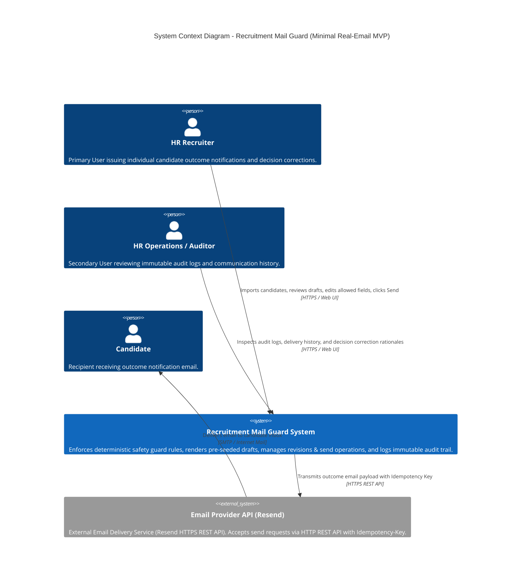
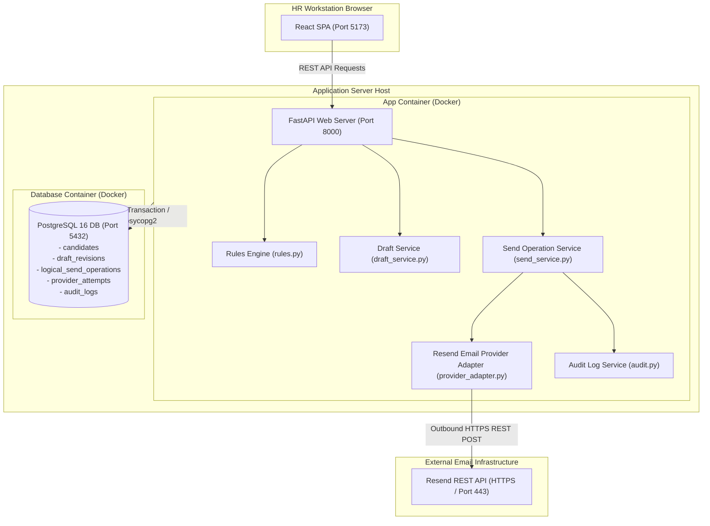
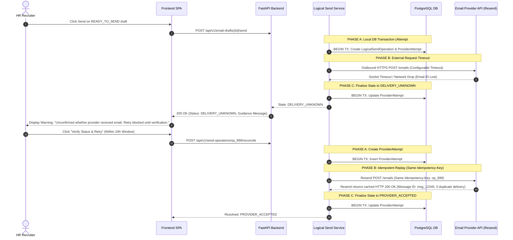
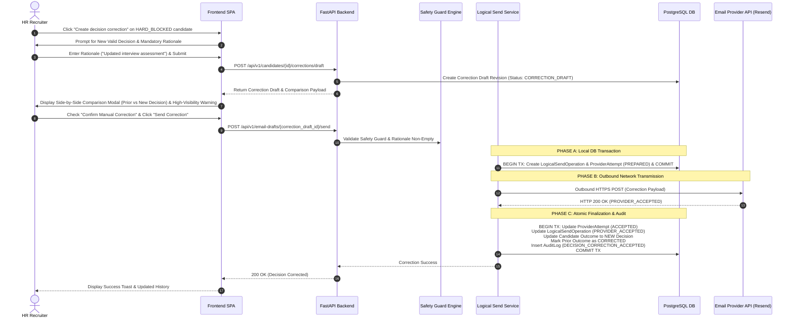
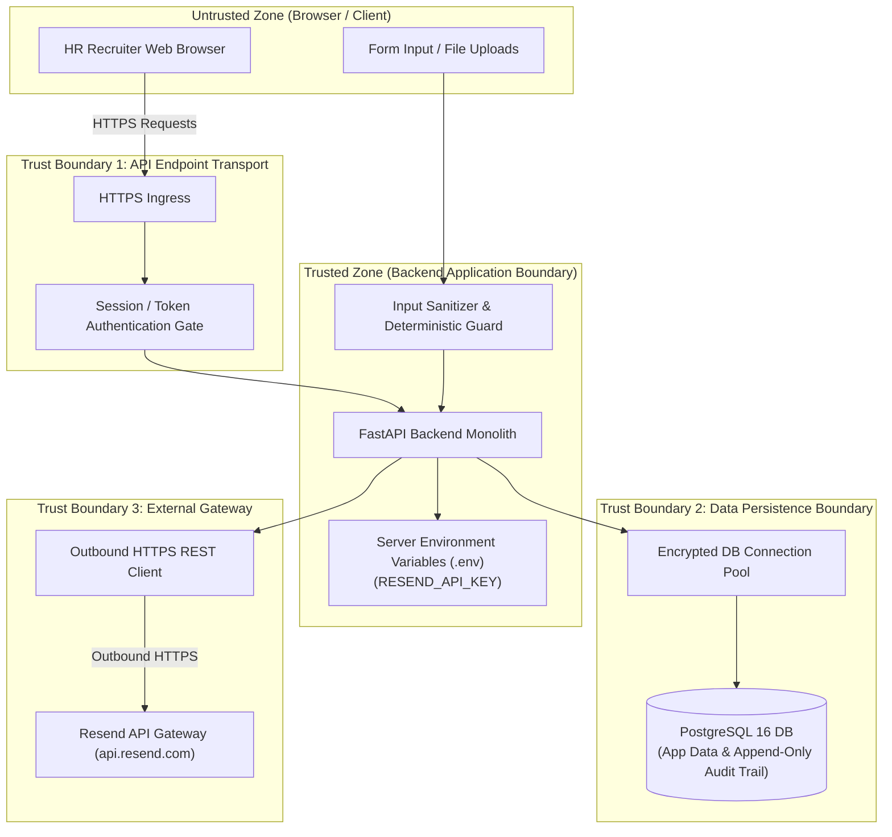

# System Architecture Specification: Recruitment Mail Guard (Minimal Real-Email MVP)

- **Project**: Recruitment Mail Guard
- **Document Status**: APPROVED_FOR_HANDOFF
- **Source Documents & Approval Record**:
  - Product Spec: `docs/product/product.md` (Approval: `APPROVED_BASELINE_FOR_BA`, Version: 1.0.1, SHA-256: `316e189df41671e629c9c370a03f39b2068b422dc8d6682a5e3ae0c1707246c7`)
  - Business Analysis Spec: `docs/ba/business-analysis.md` (Approval: `READY_FOR_HANDOFF`, Version: 1.2.0-BA, SHA-256: `d425d5f0de918d0261974906122dada3834be70cf5ee14bf1041e833eeef97ab`)

---

## 1. Executive Summary & Architectural Vision

This document presents the target system software architecture for **Team1 Recruitment Mail Guard (Minimal Real-Email MVP)**.

### Architectural Vision & Purpose
Recruitment Mail Guard provides an unyielding, deterministic safety guard for HR recruitment email communications. Its sole objective is to guarantee **zero brand-damaging contradictory decision emails per job application and stage**, enabling HR recruiters to review fixed pre-seeded candidate notification drafts and execute single-candidate outcome emails via a real email provider API with explicit manual inspection and one-click Send confirmation (`GOAL-001`, `GOAL-002`, `JOB-001`).

### Current-State Assessment & Architectural Refactoring
Evaluating the existing codebase reveals a legacy prototype architecture containing asynchronous event-driven infrastructure (RabbitMQ message broker, Redis cache, Celery worker tasks, and Transactional Outbox dispatcher) alongside LLM semantic review code. Because Product Spec (v1.0.1) and BA Spec (v1.2.0-BA) explicitly define a single-candidate, synchronous real-email workflow without batch processing or background campaign requirements (`NG-001`), this architecture refactors the system into a **Modular Monolith** (Option A, `ADR-001`).

Legacy queuing components (RabbitMQ, Redis, Celery, Outbox) and core-path LLM execution are decommissioned (`ADR-006`). The target architecture establishes a clean, decoupled **3-Phase Execution Model** (Phase A DB Commit / Phase B Outbound HTTP / Phase C DB Finalize) where candidate records imported from Excel undergo strict deterministic validation (`rules.py`), pre-send draft revisioning (`draft_service.py`), single-candidate Logical Send Operation creation (`send_service.py`), REST transmission via an Email Provider Adapter (`provider_adapter.py`, `ADR-002`), and atomic immutable audit logging (`audit.py`, `ADR-005`). Technical spike `SPIKE-001` evaluated candidate providers and selected **Resend** based on native `Idempotency-Key` header support (24h retention window) and provider-backed idempotent replay mechanics ([SPIKE-001](file:///d:/hilab/Project_W1/AI-Recruitment-Email-Assistant/docs/system-design/spikes/SPIKE-001-provider-capability.md)).

---

## 2. Architectural Drivers & Constraints

### 2.1 Functional Drivers (`DRV-F-###`)

- `DRV-F-001`: **Single-Candidate Real-Email Transmission** (`JOB-001`, `GOAL-002`, `CAP-006`, `FR-006`) — Issue individual candidate outcome emails via a real Email Provider API (Resend) with success defined as request acceptance by provider (`PROVIDER_ACCEPTED`).
- `DRV-F-002`: **Deterministic Guard Enforcement Prior to Provider Transmission** (`GOAL-001`, `CAP-004`, `NFR-001`, `BR-001`, `AC-021`) — 100% of defined deterministic rules (candidate name alignment, required placeholders, email format, stage-decision policy, subject line alignment) must pass before enabling Send or initiating any Provider Attempt.
- `DRV-F-003`: **Application ID + Stage Contradiction Prevention** (`GOAL-001`, `CAP-002`, `FR-002`, `BR-001`, `BR-005`) — Prevent sending opposing outcome emails for the same globally unique `Application ID` and `Stage/Milestone`. Opposing requests trigger a HARD_BLOCK on normal Send flow.
- `DRV-F-004`: **Pre-Send Draft Revisioning & Invalidation** (`CAP-004`, `FR-004`, `FR-011`, `BR-006`, `BR-007`, `BR-009`) — Edits to editable content (greeting, closing notes) increment Draft Revision ID, reset status to `DRAFT_PENDING_CHECK`, re-run deterministic checks, and mark unsent older revisions as `SUPERSEEDED`. Decision-critical fields remain read-only lock.
- `DRV-F-005`: **Logical Send Operation & Anti-Duplicate Safeguard** (`GOAL-004`, `CAP-007`, `FR-005`, `NFR-003`, `BR-013`) — Clicking Send creates exactly one Logical Send Operation bound to active Draft Revision ID, freezing draft content during flight.
- `DRV-F-006`: **Multiple Provider Attempts per Operation** (`CAP-007`, `FR-007`, `BR-013`, `BR-015`) — Multiple physical Provider Attempts may belong to the same Logical Send Operation during retries, retaining the original operation ID and idempotency key.
- `DRV-F-007`: **Provider Response Normalization** (`CAP-006`, `FR-006`, `BR-014`, `ADI-001`) — Direct mapping of transmission results into `PROVIDER_ACCEPTED`, `DEFINITIVE_FAILURE`, or `DELIVERY_UNKNOWN`.
- `DRV-F-008`: **Retry & Status Reconciliation Mechanism** (`FR-007`, `BR-015`, `BR-016`, `UC-006`) — In `DELIVERY_UNKNOWN` state, require status reconciliation before retry. Support HR manual resolution with warning acknowledgment and Audit Log entry.
- `DRV-F-009`: **Decision Correction Workflow** (`GOAL-003`, `CAP-008`, `FR-008`, `BR-005`, `BR-011`, `UC-007`) — Explicit workflow requiring change rationale, side-by-side warning modal, and user confirmation to issue corrected decisions post-send. Communicated decision updates ONLY after `PROVIDER_ACCEPTED`.
- `DRV-F-010`: **Immutable Append-Only Audit Trail** (`GOAL-003`, `CAP-009`, `FR-009`, `NFR-002`, `BR-012`) — Record immutable audit logs for import, draft creation, safety check result, send operation, retry, manual override, and decision correction. Action is complete only when audit record is preserved.

### 2.2 Quality Attribute Scenarios (`DRV-Q-###`)

- `DRV-Q-001`: **Contradiction Safety Protection Scenario** — For all defined and tested deterministic contradiction rules, zero Provider Attempts are initiated when a contradiction blocker is detected.
- `DRV-Q-002`: **Anti-Duplicate Operation Execution Scenario** — Exactly 1 Logical Send Operation created per Draft Revision ID during Phase A; 0 duplicate operation records created in database under concurrent requests.
- `DRV-Q-003`: **Transactional Audit Immutability Scenario** — 100% transaction consistency between entity state and audit trail in Phase C; 0 state changes committed without audit log entry; 0 modified audit records.
- `DRV-Q-004`: **Outbound Provider Response Latency & Timeout Handling Scenario** — Network timeout bounded to configurable threshold; graceful state transition to `DELIVERY_UNKNOWN` in Phase C without holding DB connections or crashing.

#### Scenario 1: Contradiction Safety Protection (`DRV-Q-001`)
- **Source**: HR Recruiter user interface input (`ACT-001`).
- **Stimulus**: HR clicks Send on an opposing decision email for an `Application ID + Stage` that already has a `PROVIDER_ACCEPTED` outcome.
- **Environment**: Normal production operating environment.
- **Artifact**: Deterministic Safety Guard (`rules.py`) / Send Endpoint (`send_service.py`).
- **Expected Response**: The system HARD_BLOCKS the Send operation, returns HTTP 422 with `BLOCKED_DETERMINISTIC`, prevents any Provider Attempt, and presents a UI link to "Create decision correction".
- **Measurable Response**: For all defined and tested deterministic contradiction rules, zero Provider Attempts are initiated when a contradiction blocker is detected.

#### Scenario 2: Anti-Duplicate Operation Execution (`DRV-Q-002`)
- **Source**: Client web browser network latency or rapid user interactions.
- **Stimulus**: HR recruiter double-clicks the Send button or reloads the browser page during an in-flight send request (`SENDING_UNCONFIRMED` or `DELIVERY_UNKNOWN`).
- **Environment**: High-latency network environment.
- **Artifact**: Logical Send Operation Service (`send_service.py`) / Database `logical_send_operations` table.
- **Expected Response**: The database enforces a `UNIQUE` constraint on `draft_revision_id` during Phase A. The backend rejects creating a second operation and returns the active existing Logical Send Operation ID.
- **Measurable Response**: Exactly 1 Logical Send Operation created per Draft Revision ID; 0 duplicate operation records created in database.

#### Scenario 3: Transactional Audit Immutability (`DRV-Q-003`)
- **Source**: Backend database transaction pipeline.
- **Stimulus**: State update operation during Phase C finalization (e.g. status set to `PROVIDER_ACCEPTED` or decision set to `CORRECTED`).
- **Environment**: Standard database execution transaction block.
- **Artifact**: PostgreSQL Database / Audit Log Service (`audit.py`).
- **Expected Response**: Main entity mutation and `audit_logs` row insertion execute inside Phase C single atomic database transaction. If audit insert fails, the transaction rolls back completely. Database permissions prohibit SQL `UPDATE` or `DELETE` queries on `audit_logs`.
- **Measurable Response**: 100% transaction consistency between entity state and audit trail; 0 state changes committed without audit log entry; 0 modified audit records.

#### Scenario 4: Outbound Provider Response Latency & Timeout Handling (`DRV-Q-004`)
- **Source**: External Email Provider API network connection (`ACT-003`).
- **Stimulus**: Outbound HTTP send request during Phase B times out or connection drops after configurable provider timeout.
- **Environment**: Unstable external provider network environment.
- **Artifact**: Email Provider Adapter (`provider_adapter.py`).
- **Expected Response**: HTTP client catches socket timeout exception, marks operation state as `DELIVERY_UNKNOWN` during Phase C finalization, logs `EMAIL_DELIVERY_UNCONFIRMED` audit event, and returns non-technical guidance to HR UI.
- **Measurable Response**: Network timeout bounded to configurable threshold; graceful state transition to `DELIVERY_UNKNOWN` without holding DB connections or crashing.

### 2.3 Constraints (`CON-###`) & Assumptions (`ASM-###`)

- `CON-001`: **Operational Simplicity** — Target architecture must be operable, deployable, and maintainable by a small engineering team using a Minimal Modular Monolith topology (`SIMPLICITY_BEFORE_SCALE`).
- `CON-002`: **Explicit Scope Prohibitions** — No automated background batch sending (`NG-001`), no automated AI hiring decisions (`NG-002`), no LLM blocking core send flow, and no multi-level manager approval workflows in MVP scope.
- `CON-003`: **Infrastructure Boundary** — RabbitMQ, Redis, Celery, and Outbox dispatcher are non-product legacy components and must not be required as product capabilities (`ADR-006`).
- `ASM-001`: **HR Data Accuracy & Status Verification** — HR recruiters are responsible for verifying source hiring decisions prior to import and checking email provider logs/client during `DELIVERY_UNKNOWN` manual resolution (`ASM-001`).
- `ASM-002`: **Spike Input: Provider REST & Normalization** — Technical Assumption: Selected provider (Resend) supports REST HTTP requests with status code mapping into `PROVIDER_ACCEPTED`, `DEFINITIVE_FAILURE`, and `DELIVERY_UNKNOWN`, and 24-hour provider-backed idempotent replay (`ADR-002`, `SPIKE-001`).

---

## 3. Feasibility Critique & Scope Boundaries

| Requirement ID | Description | Architectural Feasibility | Complexity / Constraints | Feasibility Status |
| :--- | :--- | :--- | :--- | :--- |
| `FR-001` | Excel Candidate Import | Feasible | OpenPyXL parser with DB unique constraint on `Application ID`. | `Feasible` |
| `FR-002` | Contradiction Guard | Feasible | Pure Python deterministic rules in `rules.py` querying prior sent history by `Application ID + Stage`. | `Feasible` |
| `FR-003` | Fixed Template Rendering | Feasible | Pre-seeded template dictionary separating read-only outcome sentence from editable greeting/notes. | `Feasible` |
| `FR-004` | Draft Revision Control | Feasible | `draft_revisions` DB table tracking revision counter, resetting state to `DRAFT_PENDING_CHECK` on edit. | `Feasible` |
| `FR-005` | Logical Send Operation | Feasible | DB `UNIQUE` index on `draft_revision_id` ensuring 1:1 binding and freezing draft content during Phase A. | `Feasible` |
| `FR-006` | Email Provider Adapter | Feasible | Decoupled Phase B HTTP REST client (`httpx`) with configurable timeout mapping status codes (`ADR-002`). | `Feasible` |
| `FR-007` | Delivery Unknown Handler | Feasible | Dual-path resolution: 24h provider-backed idempotent replay or HR manual override dialog writing audit record (`ADR-004`). | `Feasible` |
| `FR-008` | Decision Correction | Feasible | Separate draft flow requiring change rationale, side-by-side modal, updating outcome ONLY after `PROVIDER_ACCEPTED`. | `Feasible` |
| `FR-009` | Immutable Audit Log | Feasible | Phase C single DB transaction atomic commit (`ADR-005`) with PostgreSQL table privileges restricted to INSERT/SELECT. | `Feasible` |
| `FR-010` | Subject Line Validation | Feasible | Keyword regex rule comparing subject outcome terms against current decision. | `Feasible` |
| `FR-011` | Pre-Send Draft Supersede | Feasible | DB query marking older unsent revisions for same `Application ID + Stage` as `SUPERSEEDED`. | `Feasible` |
| `FR-012` | Application ID Identity | Feasible | Global unique constraint `(application_id)` in database schema. | `Feasible` |

---

## 4. Architectural Options & Decision Summary

The architecture analysis evaluated three candidate architectural styles:
- **Option A (Modular Monolith)**: Frontend (React SPA) + Backend API (FastAPI) + PostgreSQL 16 + Resend Email Provider Adapter. Direct 3-Phase execution.
- **Option B (Monolith + Background Worker)**: Monolith offloading provider requests to internal queue worker.
- **Option C (Event-Driven Micro-Stack)**: Retain RabbitMQ, Redis, Celery workers, and Outbox dispatcher.

### Evaluation Matrix:
- **MVP Alignment**: Option A (High) vs Option B (Medium) vs Option C (Low).
- **Operational Complexity**: Option A (Zero brokers) vs Option B (1 broker) vs Option C (3 background services).
- **Transaction Consistency**: Option A (Decoupled 3-Phase DB Commit) vs Option B (Eventual) vs Option C (Distributed Outbox).
- **Duplicate-Send Risk**: Option A (Strict DB Unique Key Phase A) vs Option B (Queue Retry Risk) vs Option C (Broker Redelivery Risk).

**Selection**: **Option A (Modular Monolith)** was selected and documented in **ADR-001** (Status: `accepted`).

### ADR Summary:
- `ADR-001`: Target Architecture Style — Modular Monolith (`FastAPI` + `React` + `PostgreSQL` + Provider Adapter) (`accepted`).
- `ADR-002`: Email Provider Adapter & Sync Response Normalization (Resend Integration & 24h Idempotent Replay) (`accepted`).
- `ADR-003`: Logical Send Operation, Provider Attempt Counter & Idempotent Retry Identity (`accepted`).
- `ADR-004`: `DELIVERY_UNKNOWN` Status Reconciliation & HR Manual Resolution Dialog (`accepted`).
- `ADR-005`: Decoupled Transaction Boundary (Phase A DB Commit / Phase B Outbound HTTP / Phase C DB Finalize) with Append-Only Immutable Audit Log (`accepted`).
- `ADR-006`: Legacy Component Disposition — Decommissioning RabbitMQ, Redis, Celery, Outbox, and LLM from core flow (`accepted`).
- `ADR-007`: Strangler-Fig Migration Strategy from Legacy Prototype Monolith to Minimal Real-Email MVP (`accepted`).

---

## 5. System Architecture & Boundaries (C4 Model)

### 5.1 C4 Level 1 - System Context


### 5.2 C4 Level 2 - Container Diagram
```mermaid
C4Container
  title Container Diagram - Recruitment Mail Guard

  Person(hr_recruiter, "HR Recruiter", "Inspects drafts, edits greetings/notes, executes Send confirmation.")

  ContainerBoundary(system_boundary, "Recruitment Mail Guard Boundary") {
    Container(spa, "Single Page Application", "React, TypeScript, Vite, Tailwind", "Provides candidate queue inspection UI, read-only decision lock display, revision edit forms, and decision correction modals.")
    
    Container(backend_api, "Backend Monolith API", "FastAPI, Python 3.11", "Executes deterministic safety guard, manages draft revisions, controls 3-Phase logical send operations, invokes Resend provider adapter, and enforces atomic transactions.")
    
    ContainerDb(database, "Relational Database", "PostgreSQL 16", "Stores candidate applications, draft revisions, logical send operations, provider attempts, and append-only audit logs.")
  }

  System_Ext(email_provider, "Resend API", "External HTTPS Email Gateway")

  Rel(hr_recruiter, spa, "Uses", "HTTPS / Port 5173")
  Rel(spa, backend_api, "Invokes REST API endpoints", "JSON / HTTPS / Port 8000")
  Rel(backend_api, database, "Phase A Commit & Phase C Finalize DB transactions", "SQL / psycopg2 / Port 5432")
  Rel(backend_api, email_provider, "Phase B Outbound REST request (configurable timeout, outside DB TX)", "HTTPS")
```

### 5.3 Deployment Topology


### 5.4 Runtime Behavior & Critical Journeys (Sequence Diagrams)

#### Journey 1: Decoupled 3-Phase Single-Candidate Send Operation Execution
```mermaid
sequenceDiagram
  autonumber
  actor HR as HR Recruiter
  participant UI as Frontend SPA
  participant API as FastAPI Backend
  participant Rules as Safety Guard Engine
  participant SendSvc as Logical Send Service
  participant DB as PostgreSQL DB
  participant Provider as Email Provider API (Resend)

  HR->>UI: Select candidate & click "Send Email"
  UI->>API: POST /api/v1/email-drafts/{id}/send
  API->>Rules: Run Deterministic Checks (Name, Email format, Contradiction)
  alt Deterministic Check Fails
    Rules-->>API: Check Failed (BLOCKED_DETERMINISTIC)
    API-->>UI: 422 Unprocessable Entity (Validation Error Details)
    UI-->>HR: Display blocker warnings; Send disabled
  else Deterministic Check Passes
    Rules-->>API: Check Passed (READY_TO_SEND)
    
    Note over SendSvc,DB: PHASE A: Local DB Transaction (Prepare & Lock)
    API->>SendSvc: Initiate Send Operation (draft_revision_id)
    SendSvc->>DB: BEGIN TX: Insert LogicalSendOperation (SENDING_UNCONFIRMED)<br/>Insert ProviderAttempt (Status: PREPARED, attempt_number: 1)<br/>Freeze Draft Revision<br/>Insert AuditLog (SEND_ATTEMPT_PREPARED)<br/>COMMIT TX (Release DB connection to pool)
    
    Note over SendSvc,Provider: PHASE B: External Network Request (Outside DB TX)
    SendSvc->>Adapter: Transmit via Resend API (operation_id as Idempotency-Key)
    Adapter->>Provider: Outbound POST /emails (Configurable Timeout)
    Provider-->>Adapter: HTTP 200/201 (Resend Message ID: msg_12345)
    
    Note over SendSvc,DB: PHASE C: Local DB Transaction (Finalize State & Audit)
    Adapter-->>SendSvc: Success (PROVIDER_ACCEPTED)
    SendSvc->>DB: BEGIN TX: Update existing ProviderAttempt (Status: ACCEPTED)<br/>Update LogicalSendOperation (Status: PROVIDER_ACCEPTED)<br/>Update Candidate Outcome (COMMUNICATED)<br/>Insert AuditLog (EMAIL_PROVIDER_ACCEPTED)<br/>COMMIT TX
    SendSvc-->>API: Operation Completed (PROVIDER_ACCEPTED)
    API-->>UI: 200 OK (PROVIDER_ACCEPTED)
    UI-->>HR: Display Success Toast & Updated Status
  end
```

#### Journey 2: Timeout, DELIVERY_UNKNOWN, and Anti-Duplicate Reconciliation Retry


#### Journey 3: Decision Correction Workflow Execution (`DEC-003`)


### 5.5 Security & Trust Boundaries


---

## 6. Data Ownership & Integration Architecture

### Data Ownership Domains
1. **Candidate Domain**: Owns candidate application metadata (`application_id`, `candidate_name`, `email`, `stage`, `status`, `position`).
2. **Draft Revision Domain**: Owns email template binding, revision numbers (`revision_id`, `version_number`), decision-critical locked content, editable content, and draft status (`DRAFT_PENDING_CHECK`, `READY_TO_SEND`, `BLOCKED_DETERMINISTIC`, `SUPERSEEDED`).
3. **Send Operation Domain**: Owns logical send operations (`operation_id`), attempt counters, operation status (`SENDING_UNCONFIRMED`, `PROVIDER_ACCEPTED`, `DEFINITIVE_FAILURE`, `DELIVERY_UNKNOWN`, `FAILED_TERMINAL`), and child provider attempts.
4. **Audit Domain**: Owns append-only, immutable operational audit logs (`audit_id`, `timestamp`, `actor_id`, `event_type`, `entity_type`, `entity_id`, `details_json`). Prohibits SQL UPDATE/DELETE.

---

## 7. Cross-Cutting Concerns

### 7.1 Security Architecture
- **Trust Boundaries**: Strictly demarcated between browser client, backend API container, PostgreSQL database, and Resend API.
- **Secret & API Key Handling**: Provider API key (`RESEND_API_KEY`) is stored in server environment variables (`.env`) and injected at runtime. Credentials are never written to source code, logged in application trace files, or sent to frontend clients.
- **Protection of Candidate PII**: Email body contents and recipient email addresses are excluded from application log files. Logs format metadata using sanitized `application_id` and masked email strings (e.g. `c***@domain.com`).
- **Encryption in Transit & Rest**: Outbound provider API requests use secure HTTPS connections. Database connections operate over TLS within container network.
- **Audit Trail Immutability**: PostgreSQL user role privileges for application database connections grant `INSERT` and `SELECT` permissions on `audit_logs`, denying `UPDATE` and `DELETE` SQL operations.

### 7.2 Scalability & Capacity Model
- **Workload Profile**: Single-candidate HR recruiter manual operation (`GOAL-002`). Peak expected throughput is 1 to 5 send requests per minute per recruiter.
- **Capacity Requirement**: Total CPU and RAM requirements for backend container are lightweight (< 0.5 CPU vCore, < 512MB RAM). PostgreSQL database storage growth is minimal (~ 1KB per send operation and audit log record). Decoupled 3-Phase execution releases DB connections during Phase B external HTTP calls.
- **Backend-Side Rate/Quota Error Normalization**: Backend owns and enforces Resend free-tier quota limits (3,000 emails/month, 100 emails/day) and translates provider rate-limit responses into operational metrics and human-readable HR guidance. Frontend does not own or decide authoritative quota logic.

### 7.3 Resilience & Failure Modes

#### Failure Matrix & Behavioral Policy:

1. **Deterministic Guard Blocked**: HTTP 422 returned. Status `BLOCKED_DETERMINISTIC`. Send button disabled. Zero Provider Attempts created.
2. **Provider Accepted**: HTTP 200/201 returned from Provider API during Phase B. Status `PROVIDER_ACCEPTED` finalized in Phase C. Communicated outcome updated. Audit log recorded.
3. **Definitive Retryable Failure (e.g. Transient 5xx / 503 Service Unavailable)**: Provider returns transient error. Status `DEFINITIVE_FAILURE` in Phase C. Retrying reuses the SAME `Logical Send Operation ID` and idempotency key, creating a new `Provider Attempt` (#2).
4. **Content / Address Validation Failure (e.g. HTTP 422 Invalid Email / Payload)**: Provider rejects payload structure. Operation state set to `FAILED_TERMINAL`. Operation retired permanently. Old operation MUST NOT be reused. HR edits editable draft text or candidate email, creating a NEW `Draft Revision` (`REV-002`).
5. **Timeout / Network Loss (Socket Timeout > configurable threshold)**: Status set to `DELIVERY_UNKNOWN` during Phase C. Normal send blocked. System displays human-readable unconfirmed warning.
6. **Reconciliation Confirms Provider Accepted (Within 24h Window)**: Provider-backed idempotent replay re-transmits exact payload with same `Idempotency-Key`. Resend returns cached response. Status updated to `PROVIDER_ACCEPTED`. Outcome updated. Audit log recorded.
7. **Reconciliation After 24h Window Expired**: Re-sending is strictly PROHIBITED after 24h idempotency key expiration. System retains `DELIVERY_UNKNOWN` state and requires HR manual resolution.
8. **Double-Click / Page Reload**: Database `UNIQUE` constraint on `draft_revision_id` in Phase A prevents duplicate operation insertion. API returns existing operation status.
9. **Decision Correction Accepted / Failed / Unknown**: Communicated outcome remains unchanged until provider returns `PROVIDER_ACCEPTED`. If failed/unknown, prior outcome remains active.
10. **Audit Log Write Failure**: Phase C DB transaction rolls back atomically. Main entity state mutation aborted. HTTP 500 returned with system error.

### 7.4 Observability & Operations
- **Structured Logging**: JSON format logs containing `timestamp`, `log_level`, `correlation_id`, `event_name`, `application_id`, and `operation_id`. PII and credentials filtered out.
- **Health & Readiness Endpoints**: `/health/liveness` returns 200 OK if FastAPI process is responsive; `/health/readiness` verifies PostgreSQL database connection ping.
- **Operational Metrics**: Basic metrics for API request duration, total send operations count by state (`PROVIDER_ACCEPTED`, `DEFINITIVE_FAILURE`, `DELIVERY_UNKNOWN`), and deterministic blocker occurrences.

---

## 8. Architectural Risks & Mitigations

- `RSK-001`: **Provider Network Instability causing `DELIVERY_UNKNOWN` state**. Impact: Temporary block on normal send flow requiring HR status verification. Mitigation: Governed by `FR-007`, `ADR-004` 24h provider-backed idempotent replay or HR manual resolution dialog with mandatory warning and Audit Log entry.
- `RSK-002`: **Residual Provider Physical Duplicate Delivery Risk**. Impact: Email provider network delivers message twice despite client idempotency header. Mitigation: Idempotency header (`Idempotency-Key: operation_id`) passed on all outbound requests (`ADR-002`); residual physical duplicate risk documented in system spec and operational procedure.
- `RSK-003`: **Database Write Failure during Audit Logging**. Impact: Recruiter action rejected. Mitigation: Governed by `ADR-005` atomic Phase C single DB transaction rollback, guaranteeing zero state changes without matching audit logs.

---

## 9. Current-State Component Disposition & Downstream Handoff

### 9.1 Current Component Inventory & Target Disposition Table

| Current Component | Target Disposition | Reason | Related Driver | Migration Action | Downstream Owner |
| :--- | :--- | :--- | :--- | :--- | :--- |
| `frontend` | `KEEP` | Primary UI for HR recruiter candidate queue, draft review, and send execution. | `DRV-F-001`, `DRV-F-008`, `DRV-F-009` | Refactor API hooks for Draft Revision and Send Operation response schemas. | Frontend |
| `backend/API` | `KEEP` | Core FastAPI application handling REST routing and business rules. | `DRV-F-001`, `DRV-F-002`, `DRV-F-003` | Retain FastAPI monolith; modularize into clear 3-Phase service layers (`ADR-007`). | Backend |
| `PostgreSQL` | `KEEP` | Primary relational database for application state and audit trail. | `DRV-F-003`, `DRV-F-010`, `DRV-Q-003` | Retain PostgreSQL 16; add schema tables for revisions, operations, attempts. | Database |
| `rules.py / validation.py` | `KEEP` | Core deterministic safety guard check implementation. | `DRV-F-002`, `DRV-F-003` | Retain & isolate deterministic rules engine from provider execution code. | Backend |
| `excelImport.py` | `KEEP` | Candidate Excel record import service. | `DRV-F-001` | Retain header contract and `Application ID` uniqueness validation. | Backend |
| `audit.py` | `KEEP` | Operational audit logging service. | `DRV-F-010`, `DRV-Q-003` | Enforce atomic Phase C DB transaction inclusion (`ADR-005`). | Backend |
| `email_workflow.py` | `SIMPLIFY` | Monolithic workflow file (350+ lines) containing simulated queue state code. | `DRV-F-004`, `DRV-F-005` | Split into `draft_service.py` and 3-Phase `send_service.py` (`ADR-007`). | Backend |
| `Email Provider Adapter` | `KEEP (NEW)` | Integrates real Email Provider API (`CAP-006`). | `DRV-F-001`, `DRV-F-007` | Implement Resend REST provider adapter with configurable timeout & status code mapping (`ADR-002`). | Backend |
| `Gemini LLM integration` | `REMOVE_FROM_CORE_FLOW` | LLM blocking core path is explicitly out of MVP scope (`NG-002`). | `CON-002`, `ADR-006` | Remove LLM call from send path; relegate to optional async advisory endpoint in `LATER`. | Backend |
| `RabbitMQ` | `REMOVE_FROM_CORE_FLOW` | Message broker not required for single-candidate synchronous send. | `CON-001`, `CON-003`, `ADR-006` | Remove service from `docker-compose.yml`. | DevOps |
| `Redis` | `REMOVE_FROM_CORE_FLOW` | Cache/broker not required for synchronous execution. | `CON-001`, `CON-003`, `ADR-006` | Remove service from `docker-compose.yml`. | DevOps |
| `Celery worker` | `REMOVE_FROM_CORE_FLOW` | Background worker tasks redundant in synchronous architecture. | `CON-001`, `CON-003`, `ADR-006` | Remove Celery app and worker task files. | Backend |
| `Outbox dispatcher` | `REMOVE_FROM_CORE_FLOW` | Outbox pattern redundant without external broker. | `CON-001`, `CON-003`, `ADR-006` | Decommission `outbox_dispatcher.py`. | Backend |

### 9.2 Downstream Handoff Contracts
- **Database Handoff**: DB Schema design for `candidates`, `draft_revisions`, `logical_send_operations`, `provider_attempts`, `audit_logs` with unique indexes on `(application_id)` and `(draft_revision_id)`.
- **UI/UX & Frontend Handoff**: Component updates for Draft Inspection, Read-Only Decision Lock, Editable Greeting/Notes, Side-by-Side Decision Correction Modal, and Human-Readable Exception Dialogs.
- **Backend Handoff**: Implementation of modular services (`rules.py`, `draft_service.py`, `send_service.py`, `provider_adapter.py`, `audit.py`) and FastAPI route handlers matching `schemas/api.py`.
- **DevOps & Infrastructure Handoff**: Simplified `docker-compose.yml` containing PostgreSQL 16 container and FastAPI app container; environment variable configuration for `RESEND_API_KEY`.
- **QA Handoff**: Test suite covering 22 Acceptance Criteria (`AC-001` through `AC-022`), deterministic guard blockers, failure classification, anti-duplicate operation uniqueness, and audit immutability.

---

## 10. User Approval Record

- User Approval Decision: APPROVED
- **Approval Date**: 2026-08-12
- **Approved By**: User
- **Selected Provider**: Resend
- **SPIKE-001 Evidence**: DOCUMENTATION_RESEARCH_COMPLETED
- **Sandbox Verification**: DOWNSTREAM_ACCEPTANCE_TASK — Backend + QA
- **Architecture Status**: APPROVED_FOR_HANDOFF
